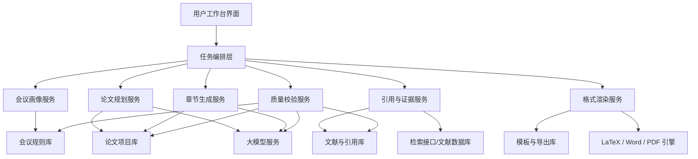
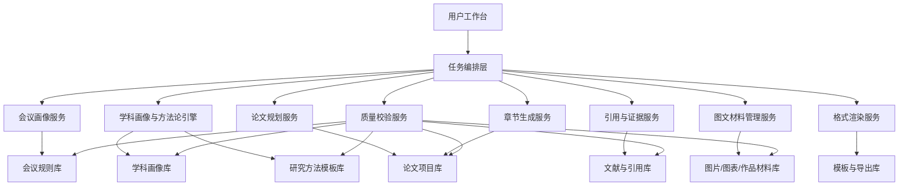

# EI论文工作台整体架构设计

## 1. 目标与结论

这套工作台的目标，不是单纯“让模型写一篇论文”，而是做成一个**面向 EI 会议投稿流程的论文生产工作台**：

1. 用户输入研究主题、目标会议、已有材料。
2. 系统自动识别该会议的模板、章节要求、篇幅限制、参考文献风格。
3. 系统分阶段生成论文：选题拆解、提纲、章节草稿、引用补全、格式输出、合规检查。
4. 最终导出可投稿的 `LaTeX` / `Word` / `PDF` 草稿包。

推荐采用的总体方案是：

**单体应用 + 可插拔流水线 + 规则引擎驱动的论文生成架构**

原因很简单：

- 对第一版最稳妥，开发和维护成本低。
- 比“纯 prompt 聊天式写作”更可控，能稳定约束格式和结构。
- 以后如果要升级成多智能体或多人协作，不需要推翻重做。

## 2. 先讲清一个关键事实

“EI 会议论文”本身**不是一个统一模板标准**。

更准确地说：

- `EI` 是收录体系，表示论文希望被 `Engineering Index` 检索。
- 真正决定格式的，通常是**具体会议**或其出版方。
- 常见模板来源包括 `IEEE`、`ACM`、`Springer`，也可能有会议自定义模板。

所以这套工作台不能写死成“EI 模板生成器”，而应该设计成：

**会议画像 + 模板适配 + 写作规则约束** 三件事分开。

这会直接影响系统架构：

- 会议规则要配置化，不写死在代码里。
- 生成过程要先绑定“目标会议画像”，再开始写作。
- 格式校验模块必须依赖会议模板规则，而不是只依赖大模型。

## 3. 方案对比

### 方案 A：纯聊天式论文生成

做法：
让用户输入主题，直接调用大模型生成整篇论文。

优点：

- 开发最快。
- 演示效果最直接。

缺点：

- 结构容易飘。
- 引用容易假造。
- 格式一致性差。
- 很难稳定适配不同会议。

结论：
只适合做 demo，不适合做真正能交付的工作台。

### 方案 B：规则驱动的分阶段论文流水线

做法：
把论文生产拆成多个阶段，每个阶段有输入、输出、校验规则。

优点：

- 可控性强。
- 便于做“章节锁定、反复修改、格式复检”。
- 更容易接入模板和引用管理。

缺点：

- 比纯聊天模式复杂一些。
- 前期设计要更细。

结论：
这是最适合第一版产品化的方案，**推荐采用**。

### 方案 C：多智能体自治写作平台

做法：
把任务拆给多个 agent，例如提纲 agent、引用 agent、格式 agent、评审 agent。

优点：

- 理论上扩展性强。
- 适合后期做复杂协作。

缺点：

- 调度复杂。
- 成本高。
- 第一版很容易“看起来先进，实际上不稳定”。

结论：
适合作为第二阶段升级方向，不建议一开始就上。

## 4. 推荐总体架构

一句话理解：

前台负责“让用户看得懂、改得动”，中间层负责“按步骤推进写作”，底层负责“规则、模板、引用、导出”。

## 5. 分层设计

### 5.1 用户层：论文工作台 UI

这一层是给用户直接操作的界面，建议包含 6 个主页面：

1. `新建论文项目`
   输入研究主题、目标会议、关键词、创新点、已有材料。

2. `会议与模板绑定`
   选择会议，查看页数限制、摘要要求、参考文献格式、模板文件。

3. `论文大纲工作区`
   先生成题目、摘要草案、章节结构，再允许用户逐段调整。

4. `章节写作区`
   按章节生成与修改，例如引言、相关工作、方法、实验、结论。

5. `引用与证据区`
   管理参考文献、查看引文出处、提示哪些句子缺少支撑。

6. `格式与导出区`
   检查模板一致性，导出 `tex/docx/pdf`。

对小白用户来说，这种 UI 最重要的价值是：

- 把“写论文”拆成一步一步，不再是一整块大任务。
- 用户能看到当前卡在哪一步。
- 用户可以只修改某一章，而不是每次重写全文。

### 5.2 任务编排层

这是整个系统的核心，相当于“总调度台”。

它不直接负责写内容，而是负责：

- 按顺序推进任务。
- 管理每一步输入输出。
- 决定什么时候允许进入下一步。
- 触发检查、重试、回滚。

建议把完整流程拆成下面 8 个阶段：

1. `项目初始化`
2. `会议规则识别`
3. `选题与贡献拆解`
4. `论文提纲生成`
5. `章节分步生成`
6. `引用补全与证据校验`
7. `格式渲染与导出`
8. `最终合规检查`

每个阶段都应保存版本，这样用户能回退到上一版，不会因为一次生成失败就丢内容。

### 5.3 领域能力层

这一层是真正做“论文生产”的地方，建议拆成 6 个核心服务。

#### 1) 会议画像服务

负责解析目标会议的规则，形成结构化配置，例如：

- 模板类型：`IEEE` / `ACM` / `Springer` / 自定义
- 页数限制
- 摘要字数要求
- 关键词要求
- 标题与作者格式
- 章节建议结构
- 引用格式
- 图片表格规范

输出结果是一个 `conference_profile`，后续所有模块都依赖它。

#### 2) 论文规划服务

负责把“用户给的主题”变成“可以写的论文结构”。

核心职责：

- 分析研究方向
- 提炼问题定义
- 识别潜在创新点
- 生成题目候选
- 生成论文提纲
- 为每章定义写作目标

这一步不应该直接写长文，而应该先把结构定稳。

#### 3) 章节生成服务

负责按章节输出草稿，建议采用“章节独立生成 + 全局上下文约束”的方式。

例如：

- 引言模块
- 相关工作模块
- 方法模块
- 实验模块
- 结论模块

每次生成都应读取：

- 当前章节目标
- 全文提纲
- 已完成章节摘要
- 会议规则
- 已绑定引用

这样可以减少前后不一致的问题。

#### 4) 引用与证据服务

这是论文工作台和普通写作工具拉开差距的关键模块。

建议它至少负责：

- 文献条目导入
- `BibTeX` 解析
- 引用去重
- 章节中的引文绑定
- “这句话是否缺文献支撑”的检测
- 风格统一，例如 `[1]`、作者年制等

原则上，不建议让模型自由编造参考文献。
系统应尽量要求“引用有来源、来源可追溯、格式可导出”。

#### 5) 格式渲染服务

负责把结构化论文内容渲染成投稿格式。

建议输出三类结果：

- `LaTeX` 工程包
- `DOCX` 草稿
- `PDF` 预览

这里不要让模型直接拼整篇最终文本，而是应基于模板把：

- 标题
- 作者信息
- 摘要
- 各章节
- 图表说明
- 参考文献

填充进模板。

#### 6) 质量校验服务

这一层用于做最终把关，建议分三类检查：

1. `结构检查`
   是否缺章节、章节顺序是否合理、摘要和结论是否对应。

2. `格式检查`
   是否符合模板、篇幅是否超限、图表标题位置是否正确、引用样式是否统一。

3. `内容检查`
   是否有明显重复、前后矛盾、空泛表述、创新点不清、实验不支撑结论。

## 6. 数据模型建议

第一版不需要上很复杂的数据库设计，但核心对象建议先想清楚。

### 6.1 论文项目 `paper_project`

- 项目 ID
- 主题
- 目标会议
- 研究领域
- 当前阶段
- 当前版本号
- 创建时间

### 6.2 会议画像 `conference_profile`

- 会议名称
- 出版方
- 模板类型
- 页数限制
- 章节规则
- 摘要规则
- 引用规则
- 模板文件路径

### 6.3 章节草稿 `section_draft`

- 章节名称
- 章节目标
- 当前内容
- 历史版本
- 状态：未开始 / 草稿 / 已确认

### 6.4 文献条目 `reference_item`

- 标题
- 作者
- 年份
- 来源
- DOI / URL
- BibTeX
- 是否已引用

### 6.5 生成任务 `generation_run`

- 任务类型
- 输入参数
- 模型版本
- 输出结果
- 校验结果
- 创建时间

这个设计的好处是：以后不管换模型、换模板、加协作，都有稳定的数据底座。

## 7. 关键流程设计

### 流程 1：新建论文

1. 用户输入主题和目标会议。
2. 系统加载会议画像。
3. 系统生成题目候选、摘要方向、章节提纲。
4. 用户确认提纲。
5. 系统进入分章节写作。

### 流程 2：章节生成

1. 用户选择某一章。
2. 系统读取该章目标、前后文摘要、相关引用。
3. 模型生成章节草稿。
4. 质量校验服务检查结构和引用。
5. 用户修改并确认。

### 流程 3：导出投稿稿件

1. 系统汇总所有已确认章节。
2. 按模板渲染成 `LaTeX/Word`。
3. 运行格式检查。
4. 输出预览与导出包。

## 8. 技术架构建议

如果你希望后面真正开发出来，我建议第一版尽量简单，别一开始上太多花哨技术。

### 推荐技术选型

- 前端：`Next.js`
  作用：做网页界面，适合搭“论文工作台”。

- 后端：`Next.js API` 或 `Node.js`
  作用：先用单体后端承接流程编排，够用、简单。

- 数据库：`PostgreSQL`
  作用：存项目、章节、会议规则、引用、任务记录。

- 对象存储：本地文件夹或 `S3` 兼容存储
  作用：存模板、导出包、PDF、Bib 文件。

- 任务队列：第一版可先不用独立消息队列
  作用：先同步执行，后面再扩展异步任务。

- 模型接入：统一封装 `LLM Gateway`
  作用：以后可以切换不同模型，不把模型调用写死在业务里。

- 文档渲染：`LaTeX` 工具链 + `Pandoc`
  作用：负责 `tex/docx/pdf` 导出。

### 为什么推荐单体优先

因为你现在要做的是“把流程跑通”，不是“提前为百万用户做云架构”。

单体优先的好处：

- 便于快速验证产品是否真的有价值。
- 调试简单。
- 小团队更容易维护。
- 后续拆服务也有清晰边界。

## 9. 关键架构决策

### ADR-001：采用单体架构，不上微服务

原因：
第一版重点是验证“能不能稳定产出符合会议要求的论文草稿”。

影响：

- 开发更快。
- 运维更轻。
- 后续若任务量变大，再把渲染和生成拆出去。

### ADR-002：采用分阶段流水线，不做一次性整文生成

原因：
整文一把生成不可控，难以修改和校验。

影响：

- 用户体验更像“工作台”，不是聊天框。
- 可以做章节锁定、版本回滚、局部重写。

### ADR-003：会议规则必须配置化

原因：
EI 会议不是统一模板，不同会议规则差异大。

影响：

- 会议适配能力更强。
- 后续可以逐步积累会议规则库。

### ADR-004：引用必须独立成服务

原因：
引用管理是论文场景的核心，不应只是正文里的一串文本。

影响：

- 可以控制引用真实性和格式一致性。
- 便于导出 `BibTeX` 和参考文献列表。

### ADR-005：导出依赖模板渲染，不依赖模型自由排版

原因：
格式问题最适合规则和模板处理，不适合完全交给模型。

影响：

- 稳定性更高。
- 更接近真实投稿流程。

## 10. 第一版 MVP 建议范围

为了尽快做出能用的版本，第一版建议只做下面这些能力：

1. 新建论文项目
2. 手动选择会议模板
3. 生成论文题目、摘要、提纲
4. 分章节生成正文
5. 录入和管理参考文献
6. 导出 `LaTeX` 和 `DOCX`
7. 基础格式检查

先不要做的功能：

- 多人协作
- 自动联网检索并全自动写引用
- 自动生成复杂实验图表
- 多 agent 自治协同
- 超复杂权限系统

这些都能做，但不适合第一版。

## 11. 第二阶段升级方向

当第一版跑通后，可以升级：

1. `会议规则抓取器`
   自动从会议官网提取模板要求。

2. `文献检索接入`
   接入学术检索源，辅助找真实文献。

3. `审稿视角检查`
   模拟审稿人，从创新性、结构、实验充分性角度挑问题。

4. `多轮改写与降重`
   在不破坏学术表达的前提下优化语言。

5. `协作与版本审阅`
   支持导师、学生、合作者共同修改。

## 12. 风险与注意事项

### 风险 1：模型会“编”

表现：
可能会编造引用、夸大结论、虚构实验结果。

应对：

- 引用必须来源可追溯。
- 实验结果区尽量要求用户提供真实数据。
- 对高风险段落加“需人工确认”标记。

### 风险 2：会议规则变化或不完整

表现：
会议官网写得不全，模板与征稿页不一致。

应对：

- 支持用户手动修正规则。
- 保留原始模板附件。
- 导出前再次显示规则检查结果。

### 风险 3：用户以为“自动生成 = 可直接投稿”

表现：
用户可能误以为生成稿已经达到学术质量标准。

应对：

- 在产品里明确标注“辅助写作，不替代学术审查”。
- 把高风险模块做人工确认步骤。

## 13. 我建议你下一步怎么走

如果按最稳妥路线推进，下一步建议是：

1. 先确定第一版只支持哪一类模板。
   我建议先做 `IEEE` 风格，因为资料多、模板成熟。

2. 先画出 3 个最核心页面。
   `新建项目`、`论文大纲工作区`、`章节写作区`。

3. 先定义 5 个核心数据表。
   `paper_project`、`conference_profile`、`section_draft`、`reference_item`、`generation_run`。

4. 再开始做原型或代码。
   这样不会一上来就陷入“模型怎么调”这种细节里。

## 14. 一句话总结

这套系统最合适的第一版形态是：

**一个单体式的论文工作台，内部用分阶段流水线驱动写作，用会议画像和模板规则约束格式，用引用服务和质量校验把住论文真实性与规范性。**

## 15. 面向服装服饰设计、艺术、时尚、人文、技术、社科与交叉学科的专用化改造

如果系统要专门服务下面这些方向：

- 服装与服饰设计
- 艺术与设计
- 时尚传播与品牌研究
- 人文与文化研究
- 技术与工程应用
- 社会科学
- 上述方向之间的交叉研究

那么系统不能只按“传统工科论文生成器”来设计，而要升级成：

**跨学科 EI 论文生成系统**

因为这类论文有一个很明显的特点：

- 题目经常跨领域，例如“智能穿戴 + 用户体验 + 时尚设计 + 可持续材料”。
- 方法不一定只有实验，可能同时出现访谈、案例研究、问卷、设计实践、原型验证、算法评估。
- 证据不一定只有数值结果，还可能包括图像分析、作品分析、文化语义分析、用户研究结论。
- 写作风格要兼顾学术规范和设计类表达，不能写得像纯算法论文，也不能写得像散文评论。

### 15.1 系统定位要改成什么

推荐的新定位是：

**面向“设计 + 技术 + 人文社科”交叉场景的 EI 会议论文生成与规范化工作台**

它的目标不是只帮用户“写”，而是帮助用户完成下面 5 件事：

1. 判断一个题目是否适合走 EI 会议论文路线。
2. 根据学科类型自动匹配合适的方法论框架。
3. 根据会议要求组织出正确的论文结构。
4. 在设计表达与学术规范之间做平衡。
5. 最终输出更接近 EI 会议要求的规范稿件。

### 15.2 必须新增的一层：学科画像与方法论引擎

在原来的“会议画像服务”之外，建议新增一个核心模块：

`discipline_profile_service` 学科画像与方法论引擎

这个模块负责识别当前题目到底更偏哪一类研究。

建议至少支持下面 7 类画像：

1. `设计创新型`
   例如服饰设计方法、系列设计、风格语言、文化转译。

2. `设计实践研究型`
   例如从设计过程、作品、原型、打样、展示中提炼研究结论。

3. `用户研究型`
   例如消费行为、穿着体验、审美偏好、交互反馈、问卷访谈。

4. `技术应用型`
   例如智能服装、可穿戴设备、数字打版、图像识别、推荐系统。

5. `人文文化型`
   例如服饰符号、文化叙事、传统纹样、时尚史、审美变迁。

6. `社科分析型`
   例如产业趋势、品牌传播、社会心理、青年文化、消费分层。

7. `交叉融合型`
   例如“非遗服饰元素 + AI 生成设计 + 用户接受度评估”。

这个引擎的作用是：

- 判断研究属于哪一类或哪几类。
- 决定推荐什么论文结构。
- 决定推荐什么研究方法。
- 决定应该要求用户补什么材料。
- 决定最终检查时重点看什么。

### 15.3 专用总体架构

在原方案基础上，建议升级为下面这个结构：

这里多出来的 2 个关键模块非常重要：

- `学科画像与方法论引擎`
  解决“这个题目到底该怎么写”的问题。

- `图文材料管理服务`
  解决设计类论文常见的作品图、流程图、款式图、实验图、问卷图表管理问题。

### 15.4 论文规划服务要如何专门改造

原来的论文规划服务主要负责“生成提纲”，现在需要升级成“按学科生成可投稿结构”。

它在收到用户主题后，先做 4 件事：

1. `识别题目类型`
   比如这是设计研究、文化研究、技术应用还是交叉研究。

2. `识别研究对象`
   比如服装产品、用户群体、品牌、工艺、材料、图像、文化符号。

3. `推荐研究方法组合`
   比如案例分析 + 访谈 + 原型设计，或者实验对比 + 问卷 + 用户测试。

4. `生成论文骨架`
   自动决定是否需要“设计过程”“案例分析”“用户研究”“实验验证”“讨论”这些段落。

举例：

- 如果题目偏 `服装设计 + 文化转译`
  系统就不该只生成“算法-实验-结果”结构，而应增加“文化元素提取”“设计转译原则”“系列设计实践”等内容。

- 如果题目偏 `智能穿戴 + 用户体验`
  系统就应生成“系统架构 + 原型实现 + 用户测试 + 结果分析”的结构。

- 如果题目偏 `时尚传播 + 社会心理`
  系统就应生成“理论背景 + 问题假设 + 问卷/访谈设计 + 数据分析 + 讨论”的结构。

### 15.5 章节生成服务必须支持多种写作模板

建议把章节生成从“统一章节 prompt”改成“按研究范式切换模板”。

至少准备下面 5 类写作模板：

1. `设计实践论文模板`
   适合服装设计、系列设计、视觉语言、作品开发。

2. `案例研究论文模板`
   适合品牌分析、文化研究、时尚现象研究。

3. `用户研究论文模板`
   适合问卷、访谈、穿着体验、消费行为、可用性测试。

4. `技术系统论文模板`
   适合智能服装、可穿戴设备、图像识别、推荐系统、数字工具。

5. `混合方法论文模板`
   适合设计 + 技术 + 社会反馈三者结合的题目。

每个模板都应该定义：

- 常见章节顺序
- 每章应该回答什么问题
- 适合出现哪些证据
- 不该写成什么样
- 常见逻辑漏洞

### 15.6 引用与证据服务也要变“多模态”

普通工科论文主要处理文献和实验数据，但你这个系统要面对更多材料类型。

因此引用与证据服务建议升级为：

`evidence_service` 证据服务

支持下面几类证据：

- 学术文献
- 会议论文
- 书籍与理论来源
- 品牌案例与行业报告
- 用户访谈记录
- 问卷统计结果
- 设计草图、效果图、样衣图、工艺图
- 原型测试结果
- 图片分析材料

注意这里有个边界：

- `学术论证` 还是应以可引用来源为主。
- `设计展示材料` 可以作为辅助证据，但不能代替核心学术论证。

所以系统应自动区分：

- 哪些内容必须有正式文献支持
- 哪些内容可以用案例或图像支撑
- 哪些内容必须提示“需要人工确认真实性”

### 15.7 图文材料管理服务是这个场景的关键差异点

针对服装、艺术、时尚、设计方向，建议专门设计一个材料管理模块。

它负责管理：

- 灵感板
- 参考图
- 设计草图
- 版型图
- 款式图
- 工艺流程图
- 用户研究截图
- 调研照片
- 原型展示图
- 数据图表

这个模块不只是“传图片”，还应支持：

- 给图片打标签
- 记录图片用途
- 记录是否能公开使用
- 关联到具体章节
- 自动生成图注初稿

这是因为设计类论文里，图往往不是装饰，而是论证的一部分。

### 15.8 质量校验规则也要按学科变化

这类系统最容易出问题的地方，就是拿同一把尺子去量所有论文。

建议质量校验分成 3 层：

1. `通用学术规范检查`
   结构完整、摘要一致、引用统一、术语前后一致。

2. `会议模板检查`
   页数、格式、图表位置、参考文献风格。

3. `学科逻辑检查`
   根据题目类型检查有没有关键内容缺失。

例如：

- 设计实践类论文
  应检查是否交代了设计目标、设计过程、方案依据、作品结果与总结。

- 用户研究类论文
  应检查是否交代样本来源、研究方法、分析方式、结果解释。

- 技术应用类论文
  应检查是否说明系统实现、实验环境、评价指标、结果对比。

- 人文文化类论文
  应检查概念界定、理论依据、案例选取理由、论证链条是否充分。

### 15.9 第一版产品定位建议再收窄一点

虽然你想覆盖很多方向，但第一版最好不要一口吃太多。

我更推荐第一版聚焦成：

**服装服饰设计与时尚科技交叉研究 EI 论文生成系统**

优先覆盖这 4 类高频题目：

1. 服装设计 + 文化元素转译
2. 服装设计 + 用户体验研究
3. 智能服装 / 可穿戴设备
4. 时尚传播 / 品牌案例 + 数据分析

原因：

- 这 4 类题目已经能覆盖你想做的大部分方向。
- 它们既有设计内容，也有技术和社科接口。
- 更适合沉淀第一版的方法模板和校验规则。

### 15.10 为这类系统新增的数据对象

除了原来的数据模型，建议再新增下面几类对象。

#### 学科画像 `discipline_profile`

- 学科主类
- 学科副类
- 推荐研究范式
- 推荐章节结构
- 推荐证据类型
- 高风险点

#### 研究方法模板 `method_template`

- 模板名称
- 适用题型
- 章节骨架
- 每章写作目标
- 证据要求
- 常见错误

#### 图文材料 `asset_item`

- 材料类型
- 文件路径
- 标签
- 关联章节
- 图注
- 授权状态

#### 研究证据 `evidence_item`

- 证据类型
- 来源
- 可信度等级
- 适用章节
- 是否需要人工确认

## 16. 针对你这个方向的最终建议

如果完全按你的目标来设计，我建议把系统正式命名和定位成：

**跨学科时尚与设计 EI 论文生成工作台**

最适合的第一版架构关键词是：

- `会议规则驱动`
- `学科画像驱动`
- `方法论模板驱动`
- `图文证据驱动`
- `分章节生成`
- `格式合规输出`

一句话说，就是：

**它不是“万能论文生成器”，而是一个懂服装、设计、时尚、人文社科与技术交叉逻辑的专用论文工作台。**
