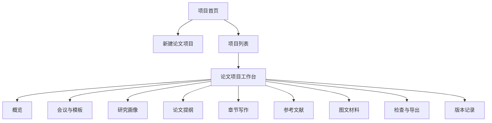

# 跨学科时尚与设计 EI 系统：产品功能与页面结构

## 1. 产品定位

### 1.1 产品名称建议

推荐名称：

**跨学科时尚与设计 EI 论文工作台**

这个名字的好处是：

- 直接说明服务方向，不会显得过于泛。
- 同时覆盖服装、设计、时尚、技术和人文社科交叉。
- “工作台”比“生成器”更准确，因为它不只是写，还包括规划、校验、导出。

### 1.2 一句话定位

这是一个专门面向**服装服饰设计、艺术、时尚、人文、社科、技术及交叉学科**的 EI 会议论文生成与规范化工作台。

### 1.3 第一版目标

第一版不追求“全自动一键成稿”，而是优先解决 4 个最关键的问题：

1. 用户不知道题目该怎么组织成 EI 论文。
2. 用户不知道不同类型题目该用什么方法和结构。
3. 用户写出来的内容容易格式不稳、逻辑不顺、引用混乱。
4. 用户缺少一个能把主题、提纲、章节、图文材料、参考文献串起来的统一工作区。

## 2. 目标用户

### 2.1 核心用户

1. 服装与服饰设计专业学生
2. 艺术设计与时尚传播方向研究生
3. 智能穿戴、时尚科技、数字设计方向研究者
4. 需要写 EI 会议论文的青年教师或研究助理

### 2.2 用户共同特征

- 对研究写作流程不够熟练。
- 题目往往跨领域，难以直接套纯工科模板。
- 手头材料很多，但难以组织成论文。
- 希望先快速形成规范草稿，再继续精修。

## 3. 第一版产品边界

### 3.1 第一版做什么

1. 新建论文项目
2. 绑定目标会议和模板
3. 自动识别题目所属学科类型
4. 自动推荐研究方法和论文结构
5. 生成题目、摘要方向、关键词和提纲
6. 分章节写作与改写
7. 管理参考文献和图文材料
8. 执行基础结构与格式检查
9. 导出 `LaTeX`、`DOCX`、`PDF`

### 3.2 第一版先不做什么

1. 多人协作编辑
2. 自动替用户虚构实验数据
3. 自动保证论文一定能录用
4. 全自动联网抓取全部会议规则
5. 超复杂的权限和团队管理

## 4. 产品信息架构

建议采用左侧主导航 + 中间工作区 + 右侧辅助面板的结构。

这个结构的核心思路是：

- “项目”是最大的工作单元。
- 每个项目内部再按论文生产流程分模块。
- 用户永远知道自己现在在哪一步。

## 5. 核心功能模块

## 5.1 模块一：项目首页

### 目标

让用户快速进入已有项目，或开始一篇新论文。

### 主要功能

- 展示项目列表
- 显示项目阶段状态
- 快速查看目标会议
- 查看最近编辑时间
- 继续上次写作
- 新建项目

### 页面组件

- 顶部产品说明区
- 项目搜索框
- 项目卡片列表
- “新建论文项目”按钮
- 最近活动区域

### 空状态文案建议

“先创建你的第一个论文项目，系统会一步一步带你从题目走到成稿。”

## 5.2 模块二：新建论文项目

### 目标

把用户脑子里的研究想法，转成一个可进入写作流程的项目。

### 主要功能

- 输入论文主题
- 选择目标会议或模板类型
- 选择学科方向
- 输入关键词
- 输入已有材料说明
- 上传参考文献、草图、图片、问卷、数据文件

### 建议表单字段

- 论文主题
- 目标会议
- 学科主类
- 学科副类
- 研究对象
- 预期方法
- 当前已有材料
- 是否已有参考文献
- 输出语言

### 页面设计要点

- 使用分步表单，不要一次堆满全部字段。
- 每一项都附一句“这是什么”的提示。
- 对不会填的用户，提供“系统帮我判断”选项。

## 5.3 模块三：会议与模板

### 目标

让用户明确自己要遵守哪套会议要求。

### 主要功能

- 展示会议基本信息
- 展示模板类型
- 展示篇幅限制
- 展示摘要和关键词要求
- 展示参考文献风格
- 上传或替换模板文件

### 页面组件

- 会议信息卡
- 模板规则清单
- 模板附件区
- 风险提示区

### 用户价值

用户能清楚知道：

- 这篇论文要按什么格式来写
- 哪些限制会影响后续生成

## 5.4 模块四：研究画像

### 目标

让系统先判断“这篇论文属于哪种研究”，避免一开始写偏。

### 主要功能

- 自动识别学科画像
- 自动推荐研究范式
- 自动推荐适合的方法组合
- 标出高风险点
- 提示还缺什么材料

### 页面输出内容

- 研究类型判断结果
- 推荐论文结构
- 推荐方法组合
- 推荐证据类型
- 风险提醒

### 示例输出

“当前题目更接近‘设计实践 + 用户研究’混合型论文，建议采用‘问题定义 - 设计目标 - 设计方案 - 原型展示 - 用户测试 - 结果讨论’结构。”

## 5.5 模块五：论文提纲

### 目标

先把整篇论文骨架搭稳，再进入分章节写作。

### 主要功能

- 生成标题候选
- 生成摘要方向
- 生成关键词
- 生成章节结构
- 调整章节顺序
- 增删章节
- 为每章设置写作目标

### 页面布局建议

- 左侧：章节树
- 中间：当前章节说明
- 右侧：系统建议和风险提示

### 用户操作

- 接受系统方案
- 手动修改标题
- 补充创新点
- 锁定提纲版本

## 5.6 模块六：章节写作

### 目标

这是系统最核心的工作区，用户在这里逐章生成、修改、定稿。

### 主要功能

- 按章节生成草稿
- 局部改写
- 扩写或压缩
- 调整语气为学术表达
- 标记需人工确认内容
- 查看章节与引用、图文材料的关联

### 页面布局建议

- 左侧：章节目录
- 中间：正文编辑区
- 右侧：辅助面板

### 右侧辅助面板建议包含

- 当前章节目标
- 应回答的问题
- 已绑定引用
- 已绑定图文材料
- 风险提醒

### 核心按钮建议

- 生成本章草稿
- 只重写这一段
- 更学术一些
- 更简洁一些
- 插入引用
- 插入图片说明
- 标记待确认

## 5.7 模块七：参考文献

### 目标

把“正文里的引用”变成可管理、可追溯、可导出的正式文献资产。

### 主要功能

- 导入 `BibTeX`
- 手动录入文献
- 文献去重
- 按章节查看已引用文献
- 检测缺少来源支撑的段落
- 导出参考文献

### 页面视图建议

- 文献列表视图
- 按章节视图
- 缺引用提醒视图

### 风险提示

如果文献缺 DOI、缺作者、缺来源，应直接标红提醒，不要静默放过。

## 5.8 模块八：图文材料

### 目标

管理设计类论文里非常重要的图像、草图、款式图、工艺图、实验图和问卷图表。

### 主要功能

- 上传图文材料
- 分类标签管理
- 绑定到章节
- 生成图注初稿
- 标记授权状态
- 记录材料用途

### 建议材料分类

- 设计草图
- 款式图
- 版型图
- 工艺图
- 原型图
- 用户研究截图
- 问卷图表
- 数据图表
- 案例图片

### 页面价值

这一页会让系统真正像“设计与时尚论文工作台”，而不是普通文本生成器。

## 5.9 模块九：检查与导出

### 目标

在导出前给用户一个清楚的“现在能不能交”的判断。

### 主要功能

- 结构完整性检查
- 格式规则检查
- 引用一致性检查
- 高风险段落提醒
- 导出 `tex/docx/pdf`

### 页面结构建议

- 顶部：总评分或总体状态
- 中部：问题列表
- 底部：导出操作区

### 检查结果建议分级

- 通过
- 建议修改
- 必须修改

## 5.10 模块十：版本记录

### 目标

避免用户因为一次生成失败或改坏内容而丢失成果。

### 主要功能

- 查看每次生成记录
- 查看提纲版本
- 查看章节历史
- 回滚到旧版本
- 比较两个版本差异

## 6. 核心用户流程

## 6.1 流程一：从主题到提纲

1. 用户新建项目
2. 填写主题和方向
3. 选择会议或模板
4. 系统生成研究画像
5. 系统推荐方法和提纲
6. 用户确认提纲

这是第一条最关键流程，因为后面写得顺不顺，取决于这里有没有走对。

## 6.2 流程二：从提纲到章节

1. 用户进入章节写作页
2. 选择某一章
3. 系统读取章节目标、会议规则、学科画像、已有关联材料
4. 生成章节草稿
5. 用户局部修改
6. 用户确认该章

## 6.3 流程三：从草稿到导出

1. 系统扫描全文
2. 检查结构、引用、图表、格式风险
3. 用户根据问题修正
4. 系统导出 `LaTeX`、`DOCX`、`PDF`

## 7. 页面级信息架构

## 7.1 一级页面

1. 项目首页
2. 新建项目页
3. 项目工作台总览
4. 会议与模板页
5. 研究画像页
6. 论文提纲页
7. 章节写作页
8. 参考文献页
9. 图文材料页
10. 检查与导出页
11. 版本记录页

## 7.2 项目工作台总览页

这个页面建议做成“总控制面板”，让用户一眼知道全局状态。

### 页面组件

- 项目基础信息
- 当前阶段进度条
- 会议规则摘要
- 学科画像摘要
- 提纲完成度
- 各章节完成度
- 引用数量与缺失提醒
- 图文材料数量
- 最近一次检查结果

### 总览页最重要的作用

- 给用户方向感
- 给用户安全感
- 告诉用户下一步该去哪

## 8. 设计风格建议

虽然现在还没开始画 UI，但建议第一版风格尽量做到：

- 学术感
- 专业感
- 不要太像聊天机器人
- 不要太像杂乱 CMS

### 推荐风格方向

- 主色偏深蓝灰或墨绿灰
- 辅助色用暖米白或低饱和金属色
- 页面留白足够
- 重点状态用清晰标签，不要靠花哨动画

### 为什么这样做

因为你的目标用户需要的是“可信、稳定、专业”，不是娱乐型 AI 工具感。

## 9. 状态设计建议

每个核心页面都应考虑下面 4 种状态：

1. `空状态`
   还没有内容时怎么引导用户开始。

2. `加载状态`
   正在生成或检查时怎么提示用户。

3. `错误状态`
   会议规则解析失败、导出失败、引用不完整时怎么提醒。

4. `完成状态`
   哪一步已经完成，是否可以进入下一步。

## 10. MVP 功能优先级

## P0：必须先做

1. 新建论文项目
2. 会议与模板绑定
3. 研究画像生成
4. 论文提纲生成
5. 章节写作
6. 参考文献管理
7. 检查与导出

## P1：推荐尽快补上

1. 图文材料管理
2. 版本记录
3. 高风险段落提醒
4. 章节目标提示面板

## P2：后面再做

1. 多人协作
2. 审稿人视角评分
3. 会议官网自动抓取
4. 更强的自动文献检索

## 11. 开发顺序建议

如果你接下来要开始做产品或开发，我建议按这个顺序推进：

1. 先做页面骨架和路由
2. 再做项目、会议、研究画像、提纲这 4 个基础模块
3. 再做章节写作
4. 再做参考文献和检查导出
5. 最后补图文材料和版本记录

## 12. 最终建议

如果要把这个产品做得像样，最重要的不是“让模型多会写”，而是先把下面这条链路做稳：

**主题输入 -> 学科判断 -> 方法推荐 -> 提纲生成 -> 分章写作 -> 引用/图文管理 -> 格式检查 -> 导出**

只要这条主链路顺，产品就已经具备很强的可用性。

一句话总结：

**第一版产品应该是一个以项目为中心、以流程为主线、以学科画像和论文规范为核心约束的 Web 工作台。**
