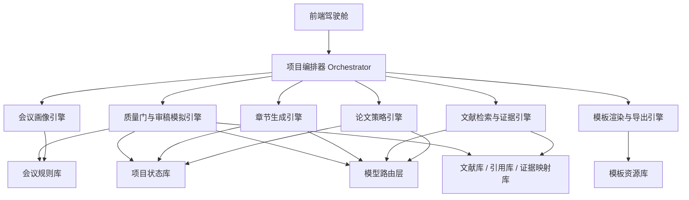

# EI论文决策式工作台从0重构总方案

## 1. 先给结论

上一版原型的问题，不是“UI 不够好看”这么简单，而是**产品定义从根上就错了**。

它把系统做成了“几个页面 + 几段示例文案 + 一个能调模型的按钮”，但用户真正要的不是这些。  
用户真正要的是：

**给我一个研究方向，后面我尽量只做选择，AI 把可选路径、可选标题、可选框架、可选章节、可选引用、可选修改方案都准备好，最后给我一篇达到 EI 投稿质量的论文和完整投稿包。**

所以这次不应该继续修旧原型，而应该把产品整体定义改成：

**不是论文生成器，而是 EI 投稿级论文生产操作系统。**

更准确地说，它应该是：

**一个“会议规则驱动 + 文献证据驱动 + 选择式交互驱动 + 质量门控驱动”的论文决策式工作台。**

---

## 2. 研究结论：外部事实到底告诉了我们什么

这轮研究的核心结论，到 2026 年 3 月 25 日为止，可以归纳成 7 条。

### 2.1 EI 不是一个统一模板

`EI` 是收录体系，不是排版规范。  
真正决定格式和审稿外观要求的，通常是具体会议及其出版方。

常见来源有：

- `IEEE Conference Proceedings`
- `ACM Proceedings`
- `Springer Conference Proceedings`，尤其是 `LNCS / CCIS / LNICST / AISC / LNNS` 这类系列
- 少量会议自定义模板

这意味着系统绝对不能只做一个“EI 模板生成器”，而必须做：

- `会议画像`
- `模板适配`
- `审稿规则适配`
- `导出渲染`

这四层能力。

### 2.2 格式合规只是底线，不是质量

官方模板只能解决：

- 页边距
- 字号字号层级
- 标题层级
- 参考文献样式
- 图表标题位置
- 双盲/非双盲要求

但它不能解决：

- 题目是否像论文题目
- 摘要是否自洽
- 贡献是否成立
- 方法是否完整
- 结果是否可信
- 文献是否真的支撑结论

所以系统不能把“排版”当主角。  
它的核心应该是**先做内容质量控制，再做格式落地**。

### 2.3 官方出版方要求里，有很多必须被系统结构化的细节

基于这轮研究，至少要把这些规则抽成结构化字段：

- 目标出版方
- 模板类型
- 是否双盲
- 标题长度偏好
- 摘要长度要求
- 关键词数量范围
- 页数限制
- 是否限制图表数量
- 参考文献样式
- 图表 caption 位置规则
- AI 使用披露要求
- 伦理声明 / 数据可用性要求

如果这些东西不结构化，后面所有生成都只是“凭感觉写”。

### 2.4 真正有用的学术 AI 产品，都不是一个大聊天框

这轮对学术写作助手的研究给了一个很明确的信号：

- 有价值的工具，会把流程拆成阶段。
- 会给中间结果。
- 会给来源。
- 会允许用户回滚与改选。
- 会做透明的证据组织。

而没有价值的工具，通常只有两个动作：

- 输入题目
- 输出一篇看起来像论文的长文

后者对投稿基本没用，因为它没有“证据链”和“质量门”。

### 2.5 用户真正需要的是“选择式交互”，不是“空白编辑器”

如果用户的理想状态是“我尽量只做选择”，那系统就不能一上来给：

- 空白文本框
- 空白提纲卡片
- 空白章节容器

而应该在每一步都提前准备好：

- 2 到 5 套可选方案
- 每套方案的适用理由
- 每套方案的风险
- 选择后会影响什么
- 哪套更稳，哪套更冒险

用户做的是**决策**，不是从零创作。

### 2.6 想达到投稿质量，系统必须对“缺材料”这件事诚实

这是整个产品成败的关键。

如果用户只给一个选题方向，而没有：

- 文献池
- 数据
- 原型
- 实验设计
- 访谈样本
- 图表

那么系统不能假装这些都存在，更不能编。

它应该做的是：

- 判断当前选题适合哪一种论文形态
- 给出 3 到 4 条**可行的研究完成路径**
- 让用户只用选择，就能把“缺材料”转成“可执行方案”

例如：

- 走 `设计实践 + 探索性用户测试` 路线
- 走 `公共数据集 + 方法比较` 路线
- 走 `系统性综述 / 文献综述` 路线
- 走 `框架型 / 方法论型论文` 路线

这才叫真正帮到用户。

### 2.7 真正的目标不是“生成一篇论文”，而是“生成一整套投稿资产”

一个真正可投稿的结果，至少不该只有正文。

它应该包括：

- 论文全文
- 题目、摘要、关键词
- 图表清单
- 参考文献包
- 双盲版 / 非双盲版
- 模板适配后的导出稿
- 审稿风险清单
- AI 使用披露建议
- 最终投稿检查单

如果没有这些，完成度就不是 80%，而很可能只有 20%。

---

## 3. 新产品定义：从结果反推，我们到底要做什么

### 3.1 新目标

新系统的目标不是“替用户写字”，而是：

**把一个模糊选题，变成一套尽量接近 EI 投稿质量的完整论文生产流程，让用户主要通过选择推进。**

更具体一点，系统应该做到：

1. 用户输入一个研究方向。
2. 系统先判断适合什么论文类型与什么会议形态。
3. 系统给出多个可选研究方案。
4. 用户选方案。
5. 系统自动继续准备下一层可选内容。
6. 整个过程里，所有中间产物都能看到、切换、比较、回退。
7. 最终得到一篇完整论文和投稿包。

### 3.2 目标边界

必须诚实说明：

**系统可以把结果推到“投稿质量”，但不能凭空保证录用或 EI 收录。**

原因不是系统不够强，而是录用本来就取决于：

- 选题新颖性
- 数据与实验真实性
- 会议匹配度
- 审稿人偏好
- 时间点竞争强度

所以产品承诺应该是：

- `最大化进入投稿质量`
- `最大化降低低级错误`
- `最大化提高会议适配和说服力`

而不是虚假承诺“保发”。

---

## 4. 从0重定义产品形态

### 4.1 不再做“多个空页面”

旧形态的问题是：

- 看起来像产品
- 实际像 brochure
- 没有真正的决策流
- 没有真正的内容流
- 没有真正的证据流

新形态应该是：

**一个单项目驾驶舱 + 多阶段工作区，而不是若干宣传页。**

### 4.2 推荐形态：EI 投稿驾驶舱

建议把主产品做成一套单项目工作台，核心布局如下：

一句话理解：

- 左边回答“我现在在哪一步”
- 中间回答“AI 这一步给了我哪些选择”
- 右边回答“这个选择靠不靠谱，缺什么，风险是什么”
- 全文视图回答“整篇现在到底长什么样”

### 4.3 推荐的四大工作区

相比现在零散的 5 个页面，更推荐 4 个大工作区：

#### 1）定题台

解决：

- 选题边界
- 会议匹配
- 论文类型
- 贡献方向

#### 2）论证台

解决：

- 文献搜索与筛选
- 研究问题与方法路径
- 证据需求
- 图表与实验清单

#### 3）写作台

解决：

- 题目 / 摘要 / 关键词方案
- 提纲方案
- 逐章候选正文
- 章节级修改与确认

#### 4）投稿台

解决：

- 全文合成
- 风险检查
- 模板渲染
- 导出包
- 最终投稿清单

这 4 个工作区每个都应该是真正能干活的，不是装饰页面。

---

## 5. 全流程重构：用户只做选择，系统每一步都提前备好内容

下面是我建议的新主流程。

### 阶段 0：输入研究方向

用户输入：

- 研究方向
- 学科偏好
- 是否有目标会议
- 是否已有材料

系统立即输出：

- 3 个候选论文方向解释
- 3 个可能的会议形态
- 1 个可行性评分
- 1 个风险结论

用户动作：

- 选择一个方向包

### 阶段 1：会议与论文类型匹配

系统输出：

- 推荐的会议画像
- 推荐的论文类型
- 推荐的审稿叙事方式

候选论文类型至少应包括：

- 设计实践主导型
- 用户研究增强型
- 技术实现支撑型
- 文献综述型
- 框架 / 方法论型

用户动作：

- 选一个类型
- 可微调“更稳 / 更冒险”“更设计 / 更工程”“更实验 / 更论证”

### 阶段 2：贡献与研究问题包

系统输出：

- 3 套问题定义
- 3 套论文贡献声明
- 3 套方法路径
- 每套方案所需证据与风险

用户动作：

- 选一个贡献包

### 阶段 3：缺口补齐路径

这是最关键的一步。

如果系统发现当前选题缺材料，不应该说“请补材料”，而应该说：

- 你现在适合走哪条完成路线
- 每条路线需要什么
- 哪条路线最容易快速完成

例如系统直接给选择：

- `路线 A：公共文献 + 设计框架型`
- `路线 B：原型展示 + 探索性用户测试`
- `路线 C：公开数据 + 技术对比`
- `路线 D：综述论文`

用户动作：

- 只选路线

### 阶段 4：文献与证据包

系统自动完成：

- 搜索关键词生成
- 初筛文献列表
- 聚类为若干主题簇
- 提取每篇文献可支持的论点
- 生成“引用池”

用户看到的不是原始搜索结果，而是：

- 主题簇卡片
- 每簇代表文献
- 每簇可支持的章节与观点

用户动作：

- 选要保留的文献簇

### 阶段 5：标题 / 摘要 / 关键词包

系统输出：

- 3 到 5 套标题方案
- 每套标题对应摘要
- 每套摘要对应关键词
- 每套摘要为什么适合该会议

用户动作：

- 选一套
- 或选择“更稳一点”“更学术一点”“更像技术论文一点”

### 阶段 6：提纲与章节计划包

系统输出：

- 2 到 3 套提纲结构
- 每章的目标
- 每章要用哪些文献
- 每章需要哪些图表
- 每章还缺什么证据

用户动作：

- 选一套提纲
- 锁定章节顺序

### 阶段 7：逐章候选正文

系统不应该只生成当前一章，而应该为每章准备：

- 当前推荐正文
- 备选写法 A
- 备选写法 B
- 本章引用建议
- 本章风险提示

用户动作：

- 选当前版本
- 或点“换一个更克制的版本”“换一个更像实验论文的版本”

### 阶段 8：全文合成

系统自动完成：

- 全文拼接
- 术语统一
- 重复论述消解
- 摘要与正文一致性检查
- 标题与摘要一致性检查

用户看到的应该是：

- 一篇完整论文
- 每章来源与证据映射
- 全文级风险提示

### 阶段 9：审稿人模拟与质量门

系统必须模拟真正投稿前的问题：

- 贡献不清
- 引言空泛
- 相关工作不足
- 方法描述不完整
- 样本来源不清
- 结果解释过度
- 结论写太满
- 引用不够
- 双盲信息泄露
- AI 使用披露缺失

输出不是一句“建议修改”，而应该是：

- 风险等级
- 具体问题
- 为什么危险
- 修改方案 A / B / C

### 阶段 10：导出与投稿包

最终必须导出：

- 盲审版全文
- 作者版全文
- 参考文献文件
- 图表目录
- 投稿检查单
- AI 使用说明建议

---

## 6. 这才是“AI 真帮到人”的完整功能清单

下面这部分是从结果反推后，系统必须补齐的能力。

### 6.1 项目初始化层

- 研究方向输入
- 材料上传
- 自动识别材料类型
- 缺失信息探测
- 可行性评分
- 风险等级判断
- 推荐论文形态

### 6.2 会议画像层

- EI 会议候选推荐
- 会议轨道推荐
- 出版方识别
- 模板类型识别
- 双盲要求识别
- 页数限制识别
- 摘要与关键词规则识别
- 参考文献规则识别
- AI 使用政策识别

### 6.3 论文策略层

- 论文类型推荐
- 贡献点推荐
- 问题定义候选
- 方法路线候选
- 标题角度候选
- 叙事结构候选
- 更稳 / 更冒险切换
- 更设计 / 更工程切换

### 6.4 文献证据层

- 联网检索
- 检索词自动生成
- 文献去重
- 文献聚类
- 摘要提取
- 论点支持抽取
- 章节映射
- 引用池管理
- 证据覆盖率统计
- 可疑引用提醒

### 6.5 方法与实验规划层

- 如果是技术型：给出基线、指标、实验结构
- 如果是设计型：给出原型路径、图文材料清单、测试任务
- 如果是用户研究型：给出样本说明、量表建议、访谈框架
- 如果是综述型：给出检索策略、纳入排除标准、分类维度

### 6.6 写作生成层

- 标题包生成
- 摘要包生成
- 关键词包生成
- 提纲包生成
- 每章正文包生成
- 每章备选语气生成
- 每章引用建议
- 每章图表建议
- 段落重写
- 全文语气统一

### 6.7 质量保障层

- 会议适配评分
- 贡献清晰度评分
- 证据支撑评分
- 方法完整度评分
- 结果可信度评分
- 结构自洽评分
- 语言克制度评分
- 参考文献健康度评分
- 图表完备度评分

### 6.8 审稿模拟层

- Reviewer 1：看贡献与结构
- Reviewer 2：看方法与证据
- Reviewer 3：看会议匹配与写作质量

每个 reviewer 都应输出：

- 主要肯定点
- 主要问题
- 可能拒稿理由
- 建议修改路径

### 6.9 导出层

- Word 导出
- LaTeX 导出
- PDF 导出
- 双盲版导出
- 作者版导出
- 参考文献导出
- 图表清单导出
- 投稿检查单导出

### 6.10 项目系统层

- 决策记录
- 版本回滚
- 方案对比
- 重新生成但保留选择
- 全文快照
- 任务状态追踪
- 自动保存

---

## 7. 真正应该建立的“质量门”

如果没有质量门，系统就会一直在“生成更多字”，而不是“变成更能投的稿子”。

建议设置 6 个强制质量门。

### Gate 1：选题可投稿性

检查：

- 有没有明确研究对象
- 有没有清晰问题
- 有没有可完成的研究路径

没过就不能往下。

### Gate 2：会议适配性

检查：

- 题目与会议主题是否匹配
- 论文类型是否匹配
- 模板与限制是否明确

### Gate 3：证据完整性

检查：

- 关键章节是否有文献支持
- 是否存在硬性缺口
- 是否缺实验 / 缺图 / 缺样本说明

### Gate 4：章节完成度

检查：

- 每章是否有明确目标
- 每章是否有正文
- 每章是否有支撑

### Gate 5：全文一致性

检查：

- 标题、摘要、正文是否一致
- 贡献是否前后统一
- 术语是否统一
- 是否存在重复

### Gate 6：导出就绪度

检查：

- 模板格式是否就绪
- 图表编号是否完整
- 参考文献是否成型
- 双盲信息是否干净
- AI 使用披露是否需要补充

---

## 8. 新 UI 应该长什么样

### 8.1 先定原则

新 UI 不应该再有以下问题：

- 标题像海报，不像产品
- 信息密度低
- 卡片大但没内容
- 按钮存在感高于正文
- 当前状态不清晰
- 右侧没有证据与风险
- 全文视图太晚出现

### 8.2 新 UI 原则

- `内容优先`：默认先展示可选内容与正文，不展示空容器
- `小字正常化`：正文和模块标题要回到产品级比例
- `三栏工作台`：决策轨道 / 当前内容 / 证据与质量
- `全文常驻入口`：任何阶段都能一键看到当前全文
- `方案卡有信息密度`：每张卡必须包含适用性、风险、影响范围
- `质量门常驻`：右侧永远显示本阶段风险与通过情况

### 8.3 新视觉方向

建议从“夸张海报式大字玻璃卡片”改成：

**冷静、精密、编辑部式的投稿工作台**

视觉关键词：

- 安静
- 专业
- 高密度
- 克制
- 有明确层级

不要再做：

- 巨型标题
- 大面积空白玻璃板
- 一屏只有一句口号

要做的是：

- 更像专业软件
- 更像编辑工作台
- 更像科研生产系统

---

## 9. 系统架构：后端也必须跟着重做

推荐采用：

**单体应用 + 能力编排层 + 规则引擎 + 证据引擎 + 导出引擎**

第一阶段不需要微服务，但内部要按领域拆清。

### 9.1 模型策略

这里必须强调：

**不能把所有任务都丢给同一个模型。**

建议至少拆成 4 类能力：

- `规划模型`：做题目类型、贡献点、提纲设计
- `写作模型`：做章节草稿与重写
- `检索模型`：做联网搜索与证据整理
- `审校模型`：做风险识别、审稿模拟、语言收束

默认可以用 `MiniMax M2.7` 作为第一版主力，但系统架构必须是可插拔的。

### 9.2 规则引擎不能缺

以下内容不能只靠模型“猜”：

- 会议格式规则
- 摘要长度规则
- 页数规则
- 双盲规则
- 导出规范
- AI 使用政策提示

这些都必须落到结构化规则上。

### 9.3 数据结构要从“文案数组”升级成“决策图”

当前原型的数据组织太浅，只能存几段示例文案。  
新系统必须以“项目决策图”来组织。

建议核心实体包括：

- `Project`
- `VenueProfile`
- `PaperStrategy`
- `Decision`
- `EvidenceSource`
- `Claim`
- `ClaimSupport`
- `SectionArtifact`
- `QualityGate`
- `ReviewReport`
- `ExportBundle`

这样系统才知道：

- 当前为什么选了这条路
- 这条路会影响哪些章节
- 哪个论点由哪篇文献支撑
- 哪个风险还没解决

---

## 10. 这次重构必须补上的“每一个角落”

这一节专门回答：到底什么叫“AI 真能帮到你”。

### 10.1 在用户输入很少时，AI 应该主动做什么

- 主动判断研究方向更像哪种论文
- 主动判断适合哪些会议形态
- 主动给出可行路线
- 主动指出不现实路径
- 主动给出完成条件

### 10.2 在用户不知道怎么选时，AI 应该主动做什么

- 告诉用户每个选项适合什么
- 告诉用户每个选项会带来什么后果
- 告诉用户哪条路最稳
- 告诉用户哪条路最容易拿到完整稿

### 10.3 在用户没有文献时，AI 应该主动做什么

- 先给文献主题簇
- 再给代表文献
- 再告诉用户这批文献分别能支撑哪一章

### 10.4 在用户没有实验时，AI 应该主动做什么

- 给出可以合法成立的论文替代路径
- 不伪造实验
- 不虚构结果
- 让用户选“转为设计验证型 / 转为综述型 / 转为方法框架型”

### 10.5 在逐章写作时，AI 应该主动做什么

- 一次给多个版本
- 每个版本标出适合原因
- 标出风险
- 标出还缺什么支撑

### 10.6 在全文阶段，AI 应该主动做什么

- 做术语统一
- 做重复压缩
- 做逻辑顺序检查
- 做摘要与结论一致性检查
- 做审稿视角问题扫描

### 10.7 在导出阶段，AI 应该主动做什么

- 检查模板
- 检查双盲
- 检查图表编号
- 检查参考文献
- 检查 AI 使用披露

---

## 11. 为什么当前完成度不到 10%

这不是情绪判断，而是功能结构判断。

按新的目标反推，当前系统主要只有：

- 一个基本前端壳
- 一个模型调用接口
- 一些示例数据
- 一个连通状态点

但真正关键的能力几乎都还没有：

- 没有会议画像
- 没有规则引擎
- 没有论文类型引擎
- 没有文献证据流
- 没有缺口补齐策略
- 没有决策图数据结构
- 没有全文驱动的状态更新
- 没有审稿模拟
- 没有模板导出
- 没有真正的质量门

所以说它现在不到 10%，这个判断我接受，而且是准确的。

---

## 12. 接下来应该怎么做：从0重建的实施路线

### Phase 0：冻结旧原型

目标：

- 不再继续补旧页面
- 保留现有模型调用与基础工程
- 把旧页面视为废弃参考

### Phase 1：重建产品骨架

必须先做：

- 新信息架构
- 新项目状态模型
- 新三栏驾驶舱布局
- 新阶段引擎
- 新决策存储结构

交付结果：

- 真正能承载后续能力的骨架，而不是宣传页

### Phase 2：重建论文策略流

必须做：

- 选题类型引擎
- 贡献包生成
- 路线选择引擎
- 标题摘要提纲包

交付结果：

- 用户给方向后，系统能连续产出多个可选包

### Phase 3：重建证据流

必须做：

- 联网搜索
- 文献聚类
- 章节映射
- 引用池
- 论点支撑检查

交付结果：

- 论文不是空写，而是有证据链

### Phase 4：重建写作流

必须做：

- 每章多版本候选
- 局部重写
- 全文实时同步
- 风险提示

交付结果：

- 用户可以真正“只做选择 + 局部修改”

### Phase 5：重建投稿流

必须做：

- 审稿模拟
- 模板检查
- 双盲检查
- Word / LaTeX / PDF 导出
- 投稿检查单

交付结果：

- 从“能看”变成“能投”

---

## 13. 我建议采用的新产品定义

如果要给这个产品一句真正准确的话，我建议定义成：

**一个面向 EI 会议投稿的决策式论文生产操作系统。**

它的核心不是“帮你写”，而是：

- 帮你选
- 帮你证
- 帮你控
- 帮你过门
- 帮你投

只有这样，它才配得上“伟大的事业”这四个字。

---

## 14. 参考来源（本轮研究）

以下来源用于支撑这轮从0重构判断：

1. IEEE Conference Author Center, Authoring Tools and Templates  
   https://conferences.ieeeauthorcenter.ieee.org/write-your-paper/authoring-tools-and-templates/

2. IEEE Conference Author Center, Structure Your Paper  
   https://conferences.ieeeauthorcenter.ieee.org/write-your-paper/structure-your-paper/

3. ACM Proceedings Templates  
   https://authors.acm.org/proceedings/production-information/taps/word-template-workflow

4. Springer Nature, Conference Proceedings Guidelines / Manuscript Preparation  
   https://www.springer.com/gp/authors-editors/conference-proceedings

5. Springer Nature, Use of AI in Scientific Writing Policy  
   https://www.springernature.com/gp/editorial-policies/ai

6. IEEE, Use of Generative AI by Authors  
   https://www.ieee.org/publications/rights/author-rights-responsibilities/generative-ai-author-policy.html

7. ACM, Generative AI and Authorship / Publication Policy Related Materials  
   https://www.acm.org/publications/policies/frequently-asked-questions

8. Paperpal Official Site  
   https://paperpal.com/

9. SciSpace Official Site  
   https://typeset.io/

10. Jenni AI Official Site  
    https://jenni.ai/

11. Elicit Official Site  
    https://elicit.com/

---

## 15. 这一轮设计的真正落点

这份方案的核心，不是“把页面写得更漂亮”，而是把方向彻底纠正：

- 从 `页面导向` 改成 `结果导向`
- 从 `空白编辑器` 改成 `选择式工作台`
- 从 `大模型写字` 改成 `会议规则 + 证据链 + 质量门`
- 从 `生成一篇文稿` 改成 `生成完整投稿资产`

后面的实现，必须严格按这个方向来。
